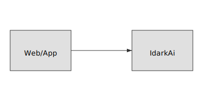

# IdarkAi Bot


IdarkAi is an open‑source AI assistant designed for effortless training, web access, and seamless integration with any website or device. The current release is built for multiple provider APIs such as **OpenAI**, **Gemini**, and **DeepSeek**. A more advanced model, **IdrakAi‑Alpha**, is scheduled for release soon.



## Features

- **Wide capabilities:** natural language conversations, basic web requests, and placeholders for custom learning.
- **Multi‑provider support:** switch between OpenAI, Gemini, or DeepSeek by changing a single parameter.
- **Easy training hooks:** a `train()` method is available for custom datasets.
- **Website ready:** lightweight design fits serverless functions, chat widgets, or full‑stack frameworks.
- **Device connectivity:** the API‑first approach enables connection to nearly any hardware.

## Installation

1. Install Python 3.11 or newer.
2. Install dependencies:
   ```bash
   pip install requests
   ```
3. Clone the repository and run your first prompt:
   ```python
   from idarkai import IdarkAi
   bot = IdarkAi(provider="openai", api_key="YOUR_OPENAI_KEY")
   print(bot.ask("Hello, world!"))
   ```

## Web Access Example
```python
from idarkai import IdarkAi
bot = IdarkAi()
print(bot.fetch_url("https://example.com"))
```

## Hosting & Integration

### Flask quick start
```python
from flask import Flask, request, jsonify
from idarkai import IdarkAi

app = Flask(__name__)
bot = IdarkAi(provider="openai", api_key="YOUR_KEY")

@app.post("/chat")
def chat():
    prompt = request.json.get("prompt", "")
    return jsonify({"response": bot.ask(prompt)})

if __name__ == "__main__":
    app.run()
```
Deploy the Flask app on services like Railway, Render, or any VPS. Point your website’s JavaScript fetch calls to the `/chat` endpoint.

### Serverless
Package the same logic inside an AWS Lambda, Google Cloud Function, or Vercel Serverless function. Ensure the API key is stored as an environment variable.

### Training pipeline
Feed your dataset into `bot.train(data)` or leverage provider‑specific fine‑tuning. Upcoming *IdrakAi‑Alpha* will broaden these options.

## SEO Keywords
IdarkAi, IdrakAI, AI bot, web integration, machine learning, OpenAI, Gemini, DeepSeek, IdrakAi‑Alpha, open source chatbot

## License
Released under the [MIT License](LICENSE).

## Credits
Full ownership retained by team leaders **Kaitlyn Brishae Truby** and **Mohammed Hilali**.
